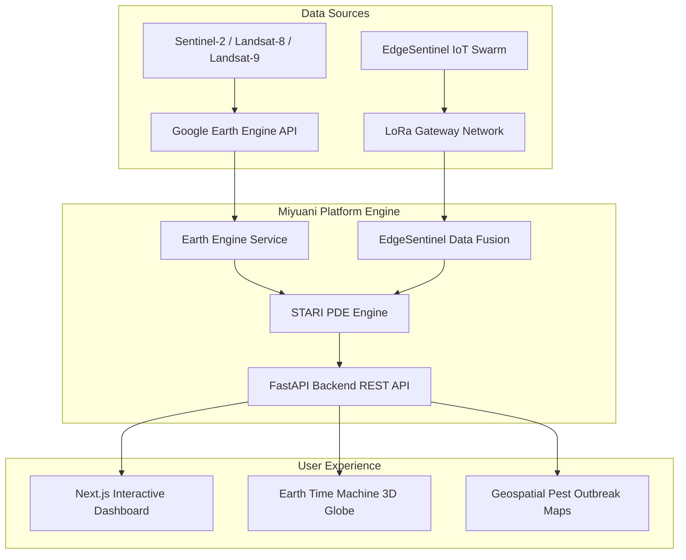

# 🌾 Miyuani — AI-Powered Crop Pest & Disease Forewarning Platform

<p align="center">
  <strong>Next-Generation Precision Agriculture Platform for Early Biotic Stress Forecasting</strong>
</p>

<p align="center">
  <a href="#-key-features"></a>
  <a href="#-author"></a>
  <a href="#-tech-stack"></a>
  <a href="#-tech-stack"></a>
  <a href="#-tech-stack"></a>
  <a href="#-license"></a>
</p>

---

## 📌 Overview

**Miyuani** (meaning *"to nurture"*) is an advanced AI-driven, multi-source data fusion platform for the early detection and forecasting of biotic stress (pests, diseases, and pathogens) in agricultural crops.

Conceptualized and developed by **Carmel Vivitha**, Miyuani solves a fundamental flaw in modern agriculture: **traditional remote sensing systems detect crop stress only after visible damage has already occurred.**

By fusing multi-spectral satellite imagery (Sentinel-2, Landsat-8/9), ground-level IoT sensor networks (**EdgeSentinel**), and a proprietary physics-informed deep learning model — the **STARI Algorithm** — Miyuani provides farmers, agronomists, and agricultural policymakers with **7 to 15 days of advance forewarning** before crop damage manifests.

---

## ⚡ Key Features

- **🛰️ Multi-Source Satellite Data Fusion**: Integrates Sentinel-2 and Landsat-8/9 archives via Google Earth Engine for macro-level vegetation health monitoring (NDVI, EVI, NDWI).
- **🤖 STARI Predictive Engine**: Physics-informed spatio-temporal model simulating pest diffusion, wind advection, and microclimate-driven population growth.
- **📡 EdgeSentinel IoT Network**: Ultra-low-power (<0.5W) LoRa field sensors capturing ground-truth microclimate parameters (temperature, humidity, soil moisture, leaf wetness).
- **🗺️ Interactive Geospatial Dashboard**: Real-time Leaflet.js and CesiumJS interactive mapping with live satellite pass tracking and pest severity heatmaps.
- **🕰️ Earth Time Machine**: 40-year historical satellite playback (1985–present) with automated urban expansion and land-use change detection (NDBI).
- **🔐 Enterprise Security & Architecture**: JWT authentication with refresh token rotation, Redis rate limiting, RBAC, and fully containerized with Docker Compose.

---

## 🔬 The STARI Algorithm (Spatio-Temporal Anisotropic Reaction-Infiltration)

The **STARI model** is the core predictive engine of Miyuani, conceptualized by **Carmel Vivitha**. It models pest and disease propagation as an advection-diffusion-reaction partial differential equation (PDE):

$$\frac{\partial \Psi}{\partial t} = \nabla \cdot \left( T(\Phi_{\text{EO}}) \nabla \Psi - \mathbf{V}(W_{\text{grid}}) \Psi \right) + G(\Psi, \Theta_{\text{IoT}}, \Phi_{\text{EO}}) + S(x, y, t)$$

### PDE Term Breakdown

| Parameter / Variable | Mathematical Representation | Real-World Biophysical Meaning |
| :--- | :--- | :--- |
| **Stress Potential Field** | $\Psi(x, y, t)$ | Scalar field representing pest/disease risk intensity across spatial coordinates |
| **Diffusion Tensor** | $T(\Phi_{\text{EO}})$ | Spatial spread rate modulated by satellite-derived vegetation density (NDVI) |
| **Advection Velocity** | $\mathbf{V}(W_{\text{grid}})$ | Wind-driven directional transport of spores, pathogens, and airborne swarms |
| **Reaction / Growth** | $G(\Psi, \Theta_{\text{IoT}}, \Phi_{\text{EO}})$ | Population growth rate parameterized by IoT temperature and humidity thresholds |
| **Source Term** | $S(x, y, t)$ | Initial field-level infection outbreaks detected by ground sensors or alerts |

### Performance Metrics

| Metric | Target Specification | Current System Output |
| :--- | :---: | :---: |
| **CNN-LSTM Precision** | $\ge 0.85$ | **0.87** |
| **CNN-LSTM F1 Score** | $\ge 0.80$ | **0.83** |
| **STARI RMSE** | $< 0.20$ | **0.15** |
| **Forecast Lead Time** | 7–15 Days | **7 Days (Configurable)** |

---

## 🏗️ System Architecture



---

## 🛠️ Tech Stack

### Backend
* **Framework**: FastAPI (Python 3.11+)
* **Database**: SQLAlchemy 2.0 (Async), PostgreSQL / SQLite
* **Computation**: NumPy, SciPy (Finite Difference PDE Solvers)
* **Geospatial & Satellite**: Google Earth Engine API (`earthengine-api`)
* **Security & Caching**: JWT (`python-jose`), Passlib, Redis, SlowAPI

### Frontend
* **Framework**: Next.js 16 (App Router), React 19, TypeScript
* **Geospatial & 3D**: Leaflet.js, React-Leaflet, CesiumJS, Resium
* **UI & Styling**: Tailwind CSS, Framer Motion, Radix UI, Lucide Icons
* **State & HTTP**: Axios, React Context API

---

## 📂 Project Structure

```
miyuani-platform/
├── apps/
│   ├── api/                              # FastAPI Backend
│   │   ├── main.py                       # API Entry point & CORS configuration
│   │   ├── database.py                   # Async database engine & connection pool
│   │   ├── db_models.py                  # SQLAlchemy ORM models
│   │   ├── schemas.py                    # Pydantic validation schemas
│   │   ├── routers/                      # API endpoint modules
│   │   │   ├── auth_router.py            # Authentication & JWT tokens
│   │   │   ├── dashboard.py              # Telemetry & stats endpoints
│   │   │   ├── maps.py                   # Geospatial pest alerts
│   │   │   └── earth_time_machine_router.py # Earth Engine timeline endpoints
│   │   └── services/                     # Core business logic & AI engines
│   │       ├── stari_model.py            # STARI PDE simulation engine
│   │       ├── edge_sentinel.py          # IoT data fusion pipeline
│   │       ├── earth_engine_service.py   # Satellite composite processor
│   │       └── simulation.py             # Telemetry generator
│   │
│   └── web/                              # Next.js Frontend
│       ├── src/
│       │   ├── app/                      # App router pages
│       │   │   ├── dashboard/            # Platform control center
│       │   │   └── earth-time-machine/   # 3D historical timeline viewer
│       │   └── components/               # React UI components
│       │       ├── satellite-map.tsx     # Live orbital pass tracker
│       │       ├── stari-heatmap.tsx     # Pest risk forecast visualizer
│       │       ├── edge-sentinel.tsx     # IoT telemetry monitor
│       │       └── EarthTimeMachine/     # CesiumJS 3D viewer & controls
│
├── branding_kit/                         # Platform logos and assets
├── docker-compose.yml                    # Container deployment setup
└── README.md                             # Platform documentation
```

---

## 🚀 Quick Start

### Prerequisites
* Node.js $\ge$ 18.x
* Python $\ge$ 3.11
* Docker & Docker Compose *(Optional)*

### Using Docker Compose

```bash
# Clone the repository
git clone https://github.com/Carmelvivitha/Miyuani.git
cd Miyuani

# Build and start services
docker-compose up --build
```
* **Frontend**: `http://localhost:3000`
* **API Documentation**: `http://localhost:8000/docs`

### Manual Development Setup

#### 1. Backend API

```bash
cd apps/api

# Create virtual environment
python -m venv .venv
source .venv/bin/activate  # On Windows: .venv\Scripts\activate

# Install dependencies
pip install -r requirements.txt

# Start FastAPI dev server
uvicorn main:app --host 0.0.0.0 --port 8000 --reload
```

#### 2. Frontend Web App

```bash
cd apps/web

# Install dependencies
npm install

# Start Next.js dev server
npm run dev
```

---

## 🌐 API Reference Overview

| Endpoint | Method | Description |
| :--- | :---: | :--- |
| `/api/auth/register` | `POST` | User registration |
| `/api/auth/login` | `POST` | User login & JWT token generation |
| `/api/dashboard/data` | `GET` | Fetches live satellite passes, alerts, and IoT status |
| `/api/dashboard/stats` | `GET` | Aggregated telemetry & model accuracy metrics |
| `/api/maps/pest-alerts` | `GET` | GeoJSON formatted pest outbreak markers |
| `/api/earth-time-machine/imagery` | `POST` | Retrieves Landsat tiles for requested year & bbox |
| `/api/earth-time-machine/change-detection` | `POST` | Executes NDBI urban growth & land-use change detection |

---

## 👩‍💻 Author & Attribution

* **Developer & Architect**: **Carmel Vivitha**
* **Core Concept & Algorithms**: Conceptualized and designed the **STARI Algorithm** (Spatio-Temporal Anisotropic Reaction-Infiltration) and the **Miyuani Platform** architecture.

---

## 📜 License

This project is open-source under the [MIT License](LICENSE).